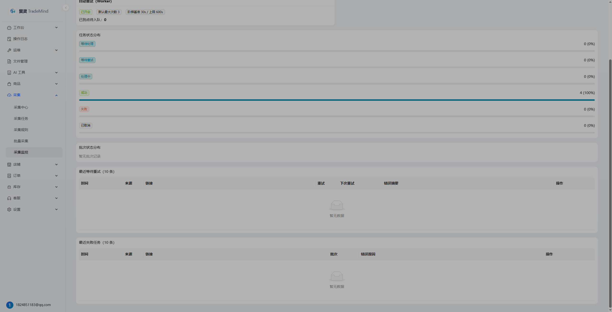
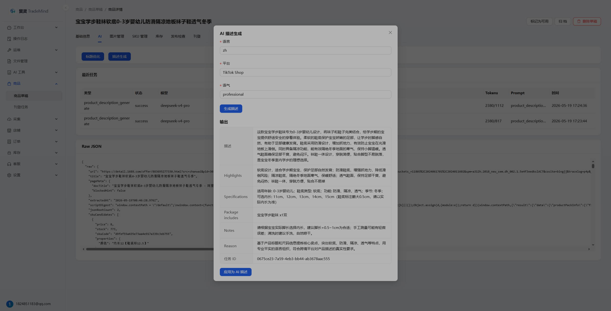

<h1 align="center">TradeMind</h1>

<p align="center">
  <strong>Open-source AI Commerce Operations Platform</strong>
</p>

<p align="center">
  Focused on product collection → drafts → AI content optimization → publishing → order and inventory workflows
</p>

<p align="center">
  <a href="LICENSE"></a>
  
  
  
  
  
</p>

<p align="center">
  <a href="README.md">简体中文</a> | English
</p>

<p align="center">
  <a href="#quick-start">Quick Start</a> ·
  <a href="#screenshots">Screenshots</a> ·
  <a href="#core-capabilities">Core Capabilities</a> ·
  <a href="#architecture-and-stack">Architecture & Stack</a> ·
  <a href="docs/README.md">Docs</a>
</p>

<p align="center">
  
</p>

TradeMind is an open-source platform for cross-border commerce sellers and developer teams. It is designed around the operational flow that happens every day: collect products, organize drafts, optimize content with AI, publish listings, and keep orders and inventory in sync.

The project currently serves two priorities: `AI product operations` and a `lightweight cross-platform ERP MVP`. Rather than trying to become a heavy all-in-one ERP, TradeMind focuses on a self-hosted, extensible foundation that teams can adapt to their own workflows.

## Project maturity

TradeMind is evolving quickly. Self-hosting, secondary development, and test-environment use are the primary scenarios today.

Before connecting real shops or performing publishing, inventory sync, or other external write operations, validate on isolated shops with small batches. See current capabilities and limits in [`docs/status/current.md`](docs/status/current.md).

## Positioning

| Area | What TradeMind focuses on |
| --- | --- |
| AI Product Operations | Product collection, drafts, AI titles and descriptions, image processing, and readiness checks. |
| Cross-platform ERP MVP | Store authorization, order sync, SKU matching, inventory sync, and product publishing as a practical MVP loop. |
| Self-hosted Extensibility | Provider-based architecture for AI, storage, image, platform, and collector integrations. |

## Screenshots

The screenshots below come from the local development environment and show the most mature flow today: **collection → draft → AI content optimization**.

<table>
  <tr>
    <td width="50%" align="center">
      
      <br />
      <sub><strong>Collection Center</strong>: collector entry points and batch collection</sub>
    </td>
    <td width="50%" align="center">
      
      <br />
      <sub><strong>Collection Tasks</strong>: URL submission, task tracking, and linked drafts</sub>
    </td>
  </tr>
  <tr>
    <td width="50%" align="center">
      
      <br />
      <sub><strong>Collection Monitor</strong>: worker, task, and batch status visibility</sub>
    </td>
    <td width="50%" align="center">
      
      <br />
      <sub><strong>AI Description Generation</strong>: generate highlights, specs, and descriptions for drafts</sub>
    </td>
  </tr>
</table>

## Core Capabilities

### AI Product Operations

- Product collection from 1688, Pinduoduo, Taobao / Tmall, and custom rules;
  Taobao / Tmall includes full per-SKU price and stock recognition through the
  browser side-panel extension.
- Product draft management for products, SKUs, images, inventory thresholds, collection warnings, and readiness checks.
- AI title optimization and description generation with prompt templates, task records, compare/apply flows, and safe rollback.
- AI image workflows through remove.bg, OpenAI Image, ComfyUI, and async task queues.

### Cross-platform ERP MVP

- Store authorization with a working Douyin Shop OAuth loop, Ozon API-key stores, encrypted secrets, and connection tests.
- Order collaboration with sync, SKU matching, and exception handling.
- Inventory collaboration with stock mirrors, alerts, and sync tasks.
- Product publishing through unified Listing Center and Listing Progress entries. The first complete flow targets Ozon with product-and-store scoped configuration, per-SKU price overrides, live local inventory, deterministic per-SKU images, package data, multi-value and complex category attributes, read-only preflight, immutable submission snapshots, and the real adapter path. Other platforms expose only capabilities that are actually integrated, and every real submission requires a second confirmation.
- AI customer-service reply suggestions with manual confirmation before sending.

### Engineering and Extensibility

- Provider abstractions for AI, storage, image, platform, and collector integrations.
- Self-host-friendly setup with PostgreSQL + Redis and a full Docker Compose deployment path.
- Monorepo structure for backend, admin, collector, and docs, making team collaboration easier.
- Reliability foundation with unified idempotency on critical writes, AI apply/undo protection, Webhook fast ACK, and worker leases against stale writeback.

## Architecture and Stack

| Layer | Stack |
| --- | --- |
| Backend | Go + Gin + GORM |
| Admin | React + TypeScript + Ant Design Pro |
| Collector | Node.js + TypeScript + Playwright; optional host-side OpenCLI Bridge |
| Data | PostgreSQL + Redis |
| Deploy | pnpm workspace + Docker Compose |
| Extension Points | AI / Storage / Image / Platform / Collector Providers |

## Quick Start

### Local Development

```bash
pnpm install
pnpm install:collector:browsers
pnpm dev
```

Useful commands:

```bash
pnpm check:dev
pnpm dev:infra
pnpm dev:backend
pnpm dev:admin
pnpm dev:collector
pnpm opencli:install-adapter
pnpm dev:opencli-bridge
pnpm docker:full:up
pnpm opencli:doctor
pnpm build:admin
pnpm build:collector
pnpm build:browser-extension
pnpm seed:demo-data
pnpm seed:demo-permissions
pnpm verify:demo-data
pnpm verify:demo-permissions
pnpm check:p4-r
```

The Playwright Collector always listens on `3001`. OpenCLI runs as an optional
host-side Bridge on `127.0.0.1:3100`. Set `OPENCLI_BRIDGE_ENABLED=true` in
`.env` to have `pnpm dev` start it as an optional process. A Bridge failure
affects OpenCLI tasks only; Playwright remains available.
TradeMind versions its Tmall/Taobao OpenCLI adapter in this repository and
safely synchronizes it when the Bridge starts. You can also run
`pnpm opencli:install-adapter`; an unrelated adapter with the same name is
never overwritten.
OpenCLI currently supports Tmall/Taobao only, and a running task never switches
to Playwright automatically after an OpenCLI failure. See the
[collector engine and deployment guide](docs/collector-engines.md) for routing,
deployment choices, migration, and troubleshooting.

### Browser Side-Panel Extension

For single-product Taobao / Tmall collection you can also use the browser
side-panel extension maintained in this repository: one click on a logged-in
Chrome / Edge product page captures the title, images, attributes, and full SKU
details (after-coupon price, original price, stock, logistics time) without an
extra browser or the OpenCLI Bridge. See the
[browser side-panel collector guide](docs/browser-extension-collector.md) for
build, install, pairing, and risk-control details. The extension, Playwright
Collector, and OpenCLI Bridge are three independent, optional entries — pick
the one that fits your scenario; none of them is required.

### Docker Deployment

```bash
cp .env.docker.example .env
pnpm docker:full:up
```

Windows PowerShell:

```powershell
Copy-Item .env.docker.example .env
pnpm docker:full:up
```

`pnpm dev` and the full Docker stack are mutually exclusive. Conflicts fail fast without stopping
Docker or unrelated port owners. Use `pnpm docker:full:up` for full-stack startup with port-owner
preflight checks.

Default URLs:

| Service | URL |
| --- | --- |
| Admin | <http://127.0.0.1:8000> |
| Backend Health | <http://127.0.0.1:8080/health> |
| Playwright Collector Health | <http://127.0.0.1:3001/health> |

Further reading:

- [docs/development.md](docs/development.md)
- [docs/docker-deployment.md](docs/docker-deployment.md)
- [docs/collector-engines.md](docs/collector-engines.md)
- [docs/env.md](docs/env.md)

## Documentation

- [docs/README.md](docs/README.md): documentation hub.
- [docs/development.md](docs/development.md): local development, debugging, and commands.
- [docs/docker-deployment.md](docs/docker-deployment.md): full Docker Compose deployment and operations.
- [docs/browser-extension-collector.md](docs/browser-extension-collector.md): browser side-panel collector guide.
- [docs/api.md](docs/api.md): API contracts, response conventions, and auth notes.
- [docs/provider.md](docs/provider.md): provider extension model and safety constraints.
- [docs/architecture.md](docs/architecture.md): architecture, layering, and data flow.
- [docs/branching.md](docs/branching.md): branch strategy and PR workflow.

## Contributing and Community

- Read [CONTRIBUTING.md](CONTRIBUTING.md) before opening a PR.
- Review [SECURITY.md](SECURITY.md) for security reporting.
- PRs that improve screenshots, sample data, or docs are also welcome.
- Sponsorship info is available in [docs/sponsor.md](docs/sponsor.md).

## License

This project is open-sourced under the [Apache License 2.0](LICENSE).
